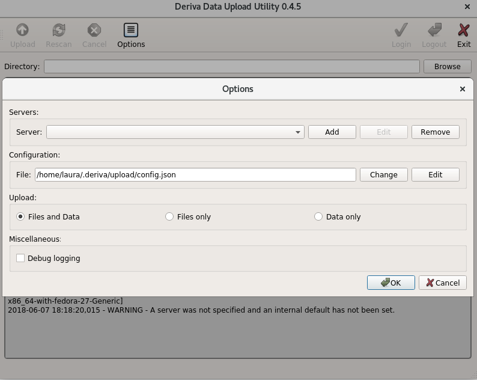
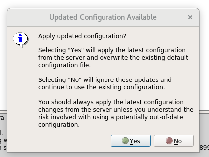
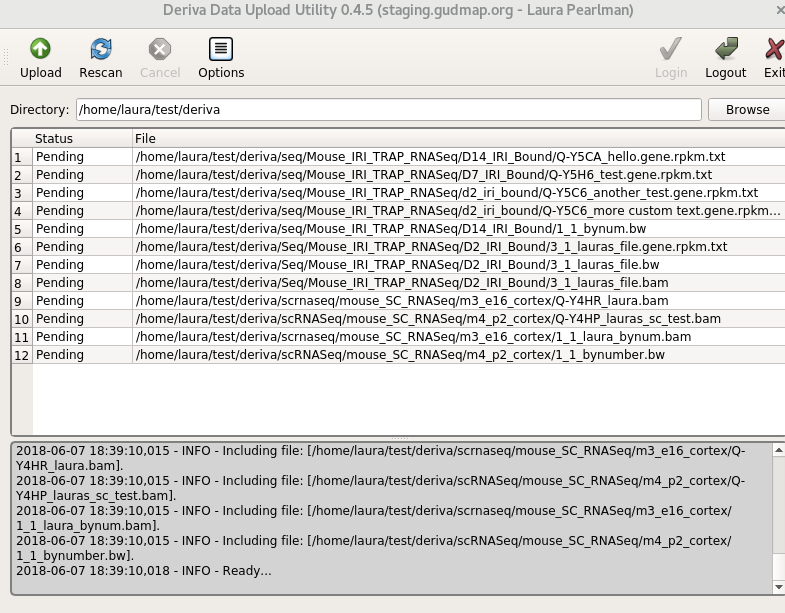

# Uploading files via DERIVA-Upload and DERIVA-Auth

DERIVA provides client tools to upload data assets to a DERIVA deployment. DERIVA-Upload handles the movement of the data files. DERIVA-Auth provides an authentication token which is required when using the command-line interface.

There are two versions of the client tool: 
* [a graphical interface that can be run to upload files from your desktop system](#from-a-desktop-system), and 
* [a command-line interface that can be used to upload files from a remote server](#from-a-remote-server)

Although the process for downloading and running the above tools are different, they both use the same directory structure designed for different data types. 

## From a desktop system

The desktop client is convenient for data files that are on your local system and aren't too large or numerous.

### 1. Initial setup

The first time you launch `deriva-upload` (through the applications menu on Windows or MacOS, or with the `deriva-upload` command on Linux), the tool will ask you if you want to add a server configuration. Click "yes" to bring up the "Options" screen (you can also do this at any time by clicking the "Options" button at the top of the page).



Click "Add" to bring up the "Server Configuration" form and enter the values provided by the DERIVA administrator.

The following are example values for the GUDMAP/RBK deployment.


### 2. Uploading files

In the main Deriva-Upload window, click the "Login" button at the top to log in. This will pop up a login dialog window. Once you've logged in, you may see a window notifying you that an updated configuration is available and asking if you'd like to apply it; you should click "Yes" to update your configuration and dismiss the window.




Next, in the main Deriva-Upload window, click the "Browse" button and select the `deriva` directory you created above. You'll see all the files you created, listed as "Pending".


Click the "Upload" button to start the upload process. The status of each file will change as it's uploaded; for successful uploads, the status will change from "Pending" to "Complete".

### 3. Logging out

Authentication tokens expire after 30 minutes of activity; you can log out explicitly by clicking on the "Logout" button at the top of the window.


## From a remote server

If your data is on a remote server and/or the data is very large or there are many files involved, you'll want to use the command-line interface (CLI).

Using the CLI on a remote server is a bit more complicated. First, you'll need to get an authentication token by running the DERIVA-Auth tool on your desktop. Then you'll run the command-line tool on the remote server.

### 1. Initial setup

On your desktop system, install the latest version of DERIVA-Auth [here](https://github.com/informatics-isi-edu/deriva-qt/releases) (for Mac or Windows desktops) or [here](https://github.com/informatics-isi-edu/deriva-qt) (for Linux desktops).

On the remote server, install the latest version of deriva-py:
```
pip3 install --upgrade git+https://github.com/informatics-isi-edu/deriva-py.git
```

### 2. Getting an authentication token

Upload requests are authorized using OAuth2; to obtain an OAuth token, run the `deriva-globus-auth-util` utility:

`deriva-globus-auth-utils login --host` _host_

You can add the `--refresh` option if you want the token to last beyond the default timeout. To end the session, you can allow the token to expire or run:

`deriva-globus-auth-utils logout`

### 3. Uploading files

On the server, run the command:

`deriva-upload-cli` --catalog _n_ --catalog _n_ _host_ _/path/to/_/deriva

where:

* _n_ is the catalog number specified by your DERIVA administrator,
* _token_ is the token cut-and-pasted from your DERIVA-Auth session, 
* _host_ is the hostname provided by your DERIVA admin, and 
* _/path/to/_/deriva is the path to the `deriva` directory you created above. 

For example:
```
deriva-upload-cli --catalog 2 --token xXXxxxxXXxxxxXxXXXxXxxxX www.gudmap.org $HOME/deriva
```

### 4. Logging out

Authentication tokens expire after 30 minutes of activity; you can log out explicitly by clicking on the "Logout" button at the top of the DERIVA-Auth window.


